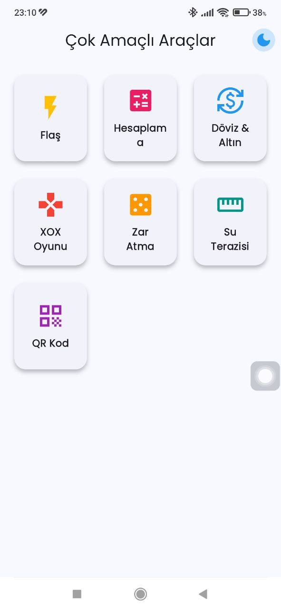
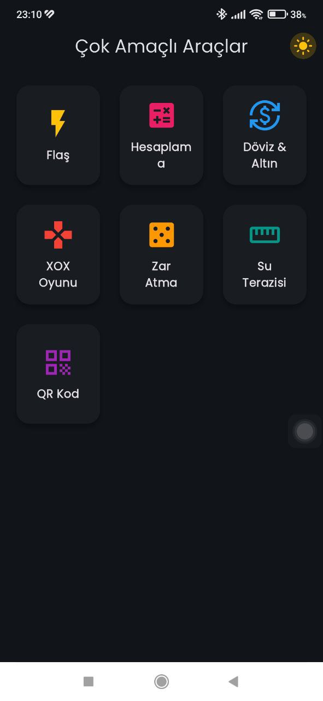
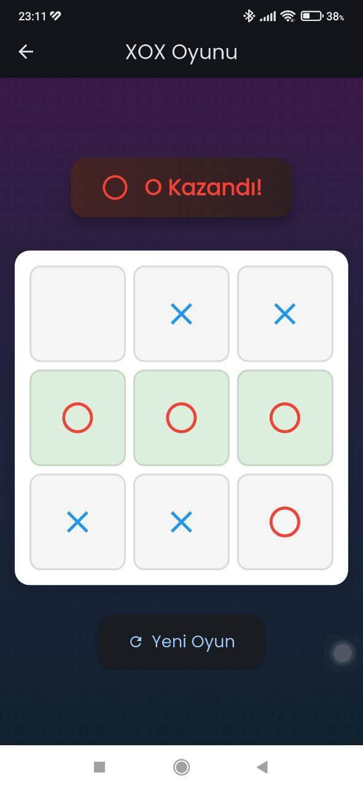
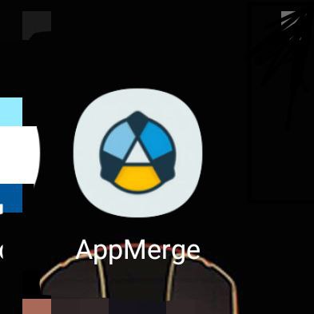

# 🧩 App Merge - Çok Amaçlı Flutter Uygulaması

Bu uygulama, Flutter ile geliştirilmiş çok amaçlı bir mobil uygulamadır. Kullanıcıya günlük hayatını kolaylaştıracak çeşitli araçlar sunar.


## 📸 Ekran Görüntüleri

<div style="display: flex; gap: 10px;margin-top: 20px;">
  
  
  
  
  
  
</div>


## 🚀 Özellikler

- 📏 **BMI Hesaplayıcı**  
  Vücut Kitle İndeksi hesaplaması yapar.

- 💱 **Döviz Çevirici**  
  Güncel kurlara göre para birimi dönüştürme.

- 🎂 **Yaş Hesaplayıcı**  
  Doğum tarihine göre yaş hesaplama.

- ❌⭕ **XOX Oyunu (Tic Tac Toe)**  
  2 kişilik klasik kutu oyunu.

- 🌓 **Tema Desteği**  
  Açık/Karanlık mod (Dark Mode) geçişi.

- 📱 **Google AdMob Reklamları**  
  Uygulama içinde banner ve geçiş reklam desteği.

## 🧠 Kullanılan Teknolojiler

- **Flutter**
- **Provider (State Management)**
- **Google Fonts**
- **AdMob (google_mobile_ads)**
- **Material 3 Design**
- **Modüler Sayfa Yapısı**

## 📁 Proje Yapısı

```bash
lib/
├── main.dart              # Giriş ve sağlayıcı tanımları
├── theme/                 # Tema yapılandırmaları
├── providers/             # State yönetimi sınıfları
├── pages/                 # Uygulama içi tüm ekranlar
└── services/              # Reklam yönetimi vb. servisler
